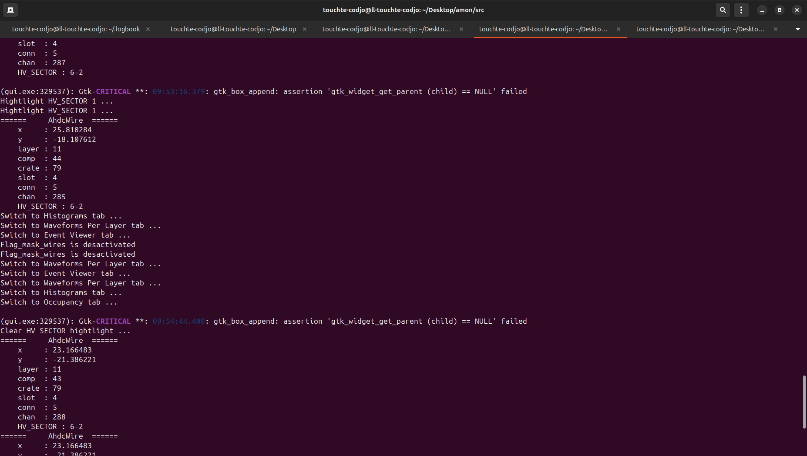

# Event with no cuts

# All signals per layer

# Event with adc cut

# Signals with adc cuts

# Histograms

# Occupancy

# Control parameters

# Terminal



## Apptainer image building from registry
```     
apptainer build amon.sif docker://codecr.jlab.org/touchte/amon/amon:docker_build
```

